# Designing-Deploying-Highly-Available-Web-Application-on-AWS

**Project Overview:**

This project showcases the end-to-end deployment of a **highly available**, **fault-tolerant**, and **scalable** web application on Amazon Web Services (AWS). The architecture is designed with a strong emphasis on **performance**, **security**, and **resilience**, utilizing a variety of AWS services to meet these goals.

### **Key Components and Architecture Design:**

1. **Custom Virtual Private Cloud (VPC):**  
   - A dedicated VPC is configured to logically isolate resources within the AWS environment.
     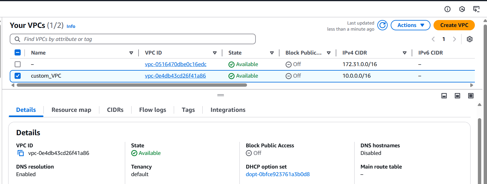  
   - The VPC includes multiple **public and private subnets** across at least **two Availability Zones (AZs)** to support high availability and disaster recovery.
     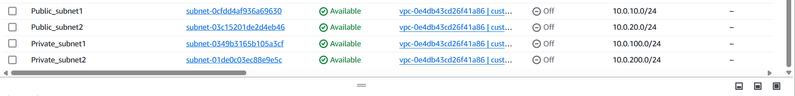  
   - **Route tables**, **Internet Gateway**, and **NAT Gateways** are properly configured to manage internal and external traffic routing.
      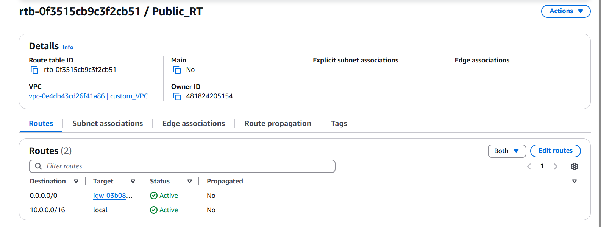
     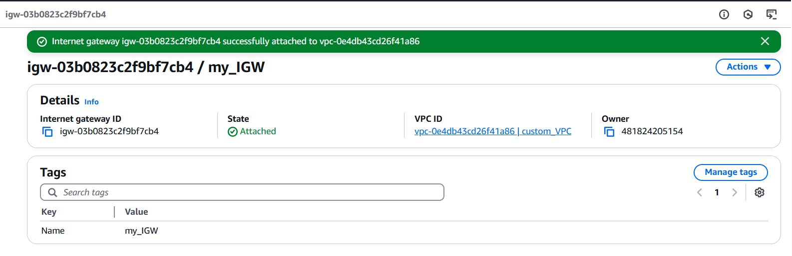
     - Resource Map of VPC:
        
    
2. **Elastic Load Balancer (ELB):**  
   - A **public-facing Application Load Balancer (ALB)** distributes incoming HTTP traffic across multiple EC2 instances in different AZs.  
   - The ALB ensures **load distribution**, **health checks**, and **failover** capabilities to maintain service availability under various traffic conditions.
     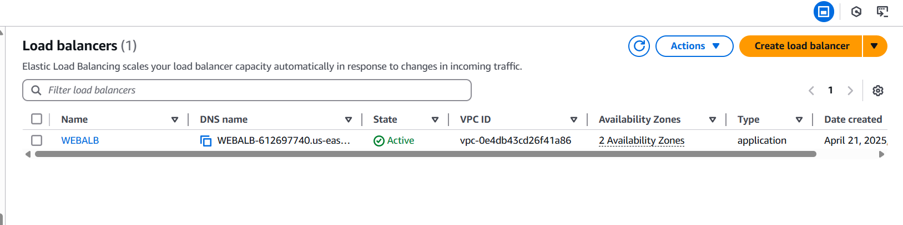
   - Target Group for traffic routing to backend instances.
     

3. **Amazon EC2 Instances:**  
   - Two EC2 instances (Web_Server1 and Web_Server2) host the web application within the private subnets, ensuring security and performance.
   - The ASGs are configured to automatically **scale out/in** based on demand.
   - Instances are launched using a pre-defined **Amazon Machine Image (AMI)** for consistency and speed.
     
  - AS Activity
    
     

4. **NAT Gateways:**  
   - NAT Gateways are deployed in the **public subnets** to allow **private subnet instances** to access the internet for updates and external communication, without exposing them directly to the public internet.
     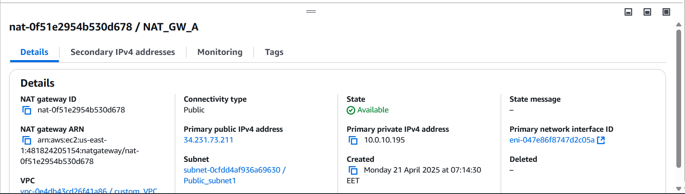
      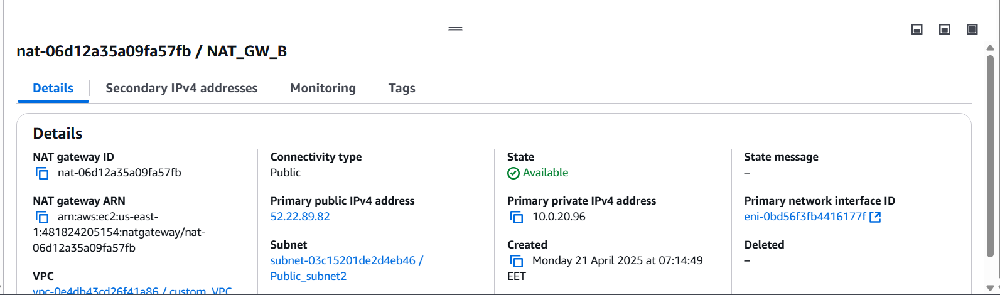

5. **Security and Access Control:**    
   - **IAM roles and policies** are applied to EC2 instances to securely access other AWS services (e.g., S3, CloudWatch) without using hardcoded credentials.
      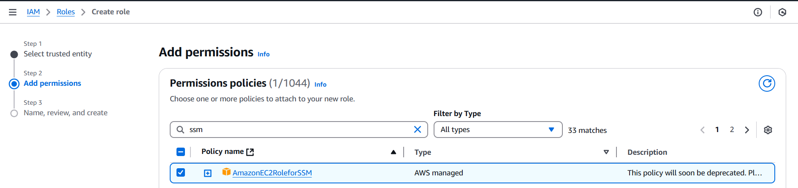
     - Security Group for Web Traffic: Allows HTTP(S) access to EC2 instances
       
     - Security Group for Auto Scaling: Controls inbound/outbound access for dynamic scaling.
       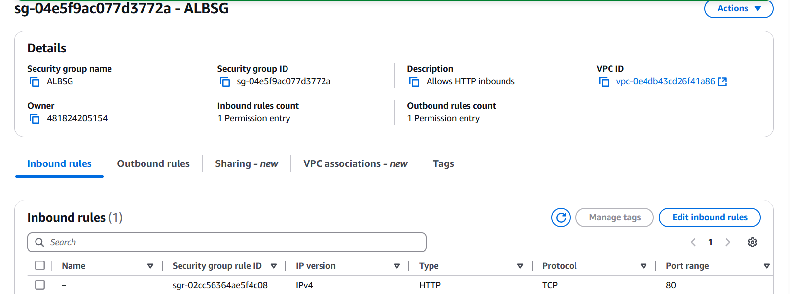

6. **High Availability and Fault Tolerance:**  
   - By distributing resources across multiple AZs, the architecture ensures continued availability in the event of an infrastructure failure in one AZ.  
   - Health checks and self-healing mechanisms automatically replace failed instances.
  
   
### **Outcomes:**

- The web application remains **accessible**, **responsive**, and **secure** even under increased load or partial system failure.
- Best practices for **network design**, **security**, and **resource provisioning** on AWS are followed throughout the project.
  
   **Test Webserver:**
   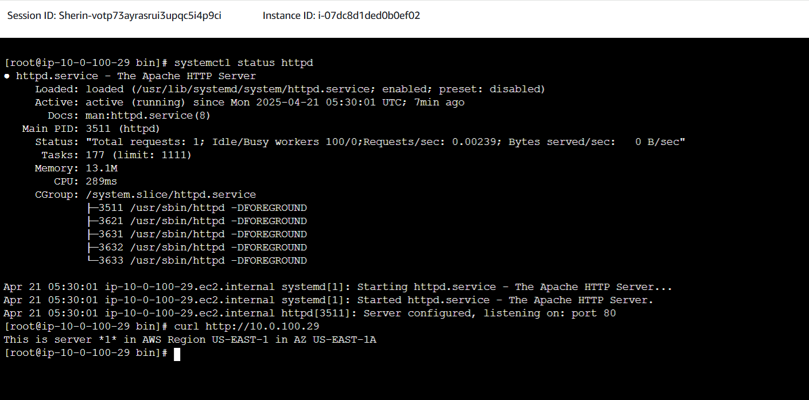
   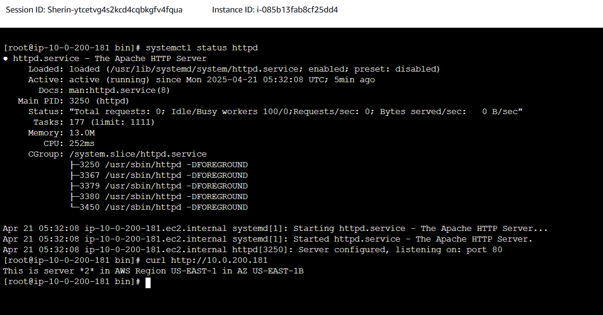
     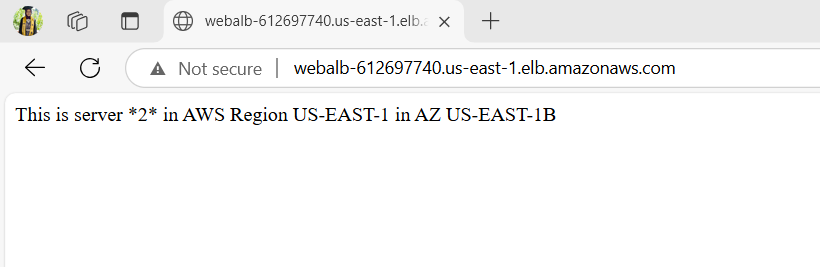
   
   - after removing Web server 1 and 2 to test the AS.
   

